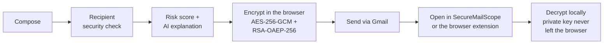
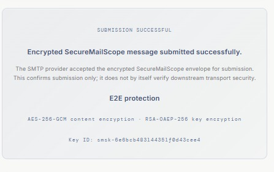

# SecureMailScope

**AI-assisted cryptographic security posture assessment for secure email communications.**

SecureMailScope tells you how securely an email will travel *before* you send it — and then
encrypts it end-to-end so that only the recipient can read it.

> Transport security (TLS) protects the pipe. SecureMailScope grades the pipe **and** locks
> the message.

Built for Smart India Hackathon 2026, Problem Statement 26159 (Blockchain & Cybersecurity).

## Live prototype

**Try it without installing anything: <https://celadon-parfait-2b9ce4.netlify.app>**

The hosted instance runs exactly this code: the recipient security check, the public-key
registry and inbox decryption all work in your browser. Outbound mail *sending* is disabled
there by the free host's network policy (it blocks SMTP ports), so the complete send flow is
demonstrated on a local run — see *Getting started* below.

## How it works



The envelope is created **in your browser**: the message is sealed with AES-256-GCM and the AES
key is wrapped with the recipient's RSA-OAEP-256 public key. What travels through Gmail is a
labelled ciphertext block — even the mail provider cannot read it. The recipient decrypts it in
the SecureMailScope dashboard, or directly inside Gmail with the included browser extension.

<p align="center">
  
</p>

### What the security check evaluates

| Check | What it tells you |
|---|---|
| MX + STARTTLS / TLS | Whether the recipient's mail servers accept encrypted connections |
| MTA-STS and DANE (TLSA) | Whether downgrade-to-plaintext attacks can be prevented |
| Server certificate | Validity, chain and expiry of the recipient's TLS certificate |
| SPF · DKIM · DMARC | Whether received mail is properly authenticated |
| Risk score + recommendations | A prioritised verdict with a plain-language explanation |
| PQC readiness · HNDL | Post-quantum readiness and hidden-data-leakage signals |

## Features

- **Recipient security posture** — live DNS/SMTP/TLS probing of the destination domain, with a
  risk score, recommendations and an AI-written explanation before you hit send.
- **End-to-end encryption** — AES-256-GCM content encryption and RSA-OAEP-256 key wrapping,
  done entirely in the browser with the Web Crypto API.
- **Local-first keys** — private keys are generated in your browser and never transmitted;
  only public keys are registered with the backend.
- **Gmail browser extension** — decrypt SecureMailScope messages directly inside Gmail.
- **EML forensics** — upload any `.eml` file and get hop reconstruction, SPF/DKIM/DMARC
  results, findings and risk scoring.
- **Key management** — key backup, rotation, and shareable public-key cards verified by
  fingerprint.
- **AI explanation layer** — optionally backed by any OpenAI-compatible LLM; a deterministic
  built-in engine works without any API key.

## Repository layout

| Path | What it is |
|---|---|
| `backend/` | FastAPI service: DNS/SMTP/TLS analysis, EML forensics, risk/PQC/HNDL engines, AI layer, sending (SMTP + Gmail API), inbox reading (IMAP + Gmail API), public-key registry |
| `frontend/` | React + Vite dashboard (Compose, Security review, Inbox, E2E identity management) |
| `extension/` | Chrome/Edge extension that decrypts SecureMailScope messages inside Gmail |
| `samples/` | Sample `.eml` files for the forensics API |
| `docs/` | Images used in this README |
| `context/` | Original problem statement and reference material |
| `CHANGES.md` | Full change log, architecture notes and extended test guide |
| `RUN-DEMO.md` | Operator runbook: live demo script and deployment steps |

## Getting started

**Prerequisites:** Python 3.11+, Node.js 20.19+ (22 LTS recommended), Git, and Chrome or Edge
if you want the Gmail extension.

### Windows (one click)

```bat
git clone https://github.com/Stellervision/SecureMailScope-.git
cd SecureMailScope-

:: first run only — creates the Python venv and installs all dependencies
setup.bat

:: starts the backend (port 8000) and the frontend (port 5173)
start.bat
```

Open the app in your browser: the [live prototype](#live-prototype) needs no setup, or use
your local copy at `http://localhost:5173`.

### macOS / Linux

```bash
git clone https://github.com/Stellervision/SecureMailScope-.git
cd SecureMailScope-

# Terminal 1 — backend
cd backend
python3 -m venv .venv && source .venv/bin/activate
pip install -r requirements.txt
uvicorn app.main:app --host 127.0.0.1 --port 8000 --reload

# Terminal 2 — frontend
cd frontend
npm install
npm run dev -- --host localhost --port 5173 --strictPort
```

The REST API is self-documenting: with the backend running, open Swagger UI at
`http://127.0.0.1:8000/docs`.

## Connecting a mailbox

Connect at least one Gmail account to send and receive. Two options:

**Option A — Gmail App Password (recommended, no Google Cloud setup)**

1. Enable 2-Step Verification on the Gmail account, then create an App Password:
   https://myaccount.google.com/apppasswords (16 letters, shown once).
2. In the app: **COMPOSE → Mailbox → + Add mailbox** → fill the SMTP form:
   the Gmail address as email/username, the 16-letter **App password** (not the Gmail
   password) as credential, host `smtp.gmail.com`, port `587`, security `starttls`.
3. Save → **Attach** → **Use this account**.

Sending goes over SMTP and the inbox is read over IMAP — no OAuth configuration needed.

**Option B — Google OAuth (optional):** create an OAuth client in Google Cloud with redirect
URI `http://127.0.0.1:8000/api/mailbox/oauth/gmail/callback`, put the client ID and secret in
`backend/.env` (see `backend/.env.example`), then use **Continue with Google**.

Connecting a mailbox also creates your **encryption key pair in that browser**. The private
key never leaves the browser; only the public key is registered.

## Sending and reading encrypted mail

**Same browser, two accounts (simplest):** connect the recipient's account first, then the
sender's. Compose → **Check recipient security** → write the message → **Confirm & Send**.
Switch to the recipient's account → **INBOX** → open the mail marked **E2E encrypted** → it
decrypts locally.

**Two machines:** each instance holds its own keys, so the recipient shares their **public key
card** (INBOX → *Share my public key card* — it contains no private key, so it is safe to send
over chat) and reads the fingerprint out loud. The sender imports it (INBOX → *Import contact's
key card*), verifies the fingerprint, then composes and sends as above.

## Decrypt inside Gmail (browser extension)

1. Open `chrome://extensions`, enable **Developer mode**, click **Load unpacked** and select
   the `extension/` folder of this repo.
2. Open your local app (`http://localhost:5173`) once in the same browser — the extension
   copies your keys locally.
3. Open the encrypted mail in Gmail: a green **"Decrypted locally by SecureMailScope"** panel
   shows the message and attachments.

## Configuration

Everything works out of the box; all of this is optional (`backend/.env`):

| Variable | Purpose |
|---|---|
| `SECUREMAILSCOPE_GOOGLE_CLIENT_ID` / `_SECRET` | Enables Google OAuth sign-in (Option B) |
| `SECUREMAILSCOPE_AI_API_KEY` (+ optional `_BASE_URL`, `_MODEL`) | Routes the explanation layer through an OpenAI-compatible LLM; without it the deterministic built-in engine is used |
| `SECUREMAILSCOPE_CORS_ORIGINS` | Extra allowed frontend origins (comma-separated) when the UI is hosted on another domain |

## Security model

- Private keys are generated with the Web Crypto API in the browser and exist only in that
  browser's storage (and the extension's local storage). They are never transmitted.
- The backend registry stores **public** keys and fingerprints only — it can never decrypt.
- Public-key contact cards are safe to share; always verify the fingerprint through a second
  channel (a call, not the same chat).
- Mailbox credentials (App Passwords / OAuth tokens) are stored server-side so the backend can
  send and read mail; they are never displayed in the UI.
- Never commit or share `backend/.env`, `backend/data/` or `securemailscope-identity-*.json`
  key backups — they are git-ignored for a reason.

## Extending SecureMailScope

The codebase is deliberately small and readable:

- `backend/app/api/` — thin FastAPI routers: `domain` (recipient posture), `eml` (forensics),
  `send`, `mailbox`, `crypto`, `ai`.
- `backend/app/services/` — one module per capability: `domain_assessment.py` (DNS/MTA-STS/
  DANE/STARTTLS probing), `email_sender.py` (SMTP/IMAP/Gmail API), plus focused packages for
  `dns`, `tls`, `smtp`, `crypto`, `risk`, `eml` and `ai`.
- `frontend/src/` — the dashboard; `services/` holds the API and browser-crypto clients.
- `extension/` — plain HTML/JS Manifest V3 extension; it receives keys from the dashboard
  through a local app bridge.

Ideas that fit naturally: more IMAP/SMTP providers, a PCAP analysis module for passive TLS
posture mining, MTA-STS policy caching, structured export of forensic reports, or wiring the
AI layer to a locally hosted model.

Contributions are welcome: fork, create a branch, open a pull request. Please never commit
credentials or key material.

## Troubleshooting

| Problem | Fix |
|---|---|
| "Failed to fetch" | The backend is not running — start it (`start.bat`) and refresh. |
| "Authentication failed" when saving a mailbox | You used the normal Gmail password; use the 16-letter **App password**. |
| Encrypted mail shows as raw text / **Key mismatch** | Open it in the same browser where that mailbox was connected, or use **Import key backup**. |
| SMTP/TLS shows "Not observable" | Your network blocks port 25 — that is an honest result, not a bug. |
| "Port 5173 is in use" | Another copy is already running; close it and start again. |

The extended list lives in `CHANGES.md`, the demo/deployment runbook in `RUN-DEMO.md`.

## Acknowledgements

Built for **Smart India Hackathon 2026**, Problem Statement **26159** — AI-assisted passive
network forensics for email cryptographic security — by Team Stellervision.
